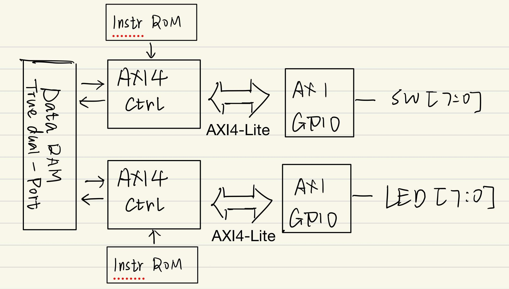

# AXI4_Lite_Master_Controller
The HDL design for AXI4_Lite master controller to driven the AXI4 based Xilinx IPs like AXI-GPIO AXI-IIC

## BLOCK Diagram

  
</p
Figure.1 Design Block Diagram 

## Controller Instruction Set

### 🧠 Instruction Format Overview

| Bit Range  | 31–27       | 26–20     | 19–12       | 11–3        | 2–0      |
|------------|-------------|-----------|-------------|-------------|----------|
| Field Name | `RESERVED`  | `COUNT`   | `ADDR_LOCAL`| `ADDR_AXI`  | `OPCODE` |
        
Each instruction is exactly 32 bits, structured as follows:

| Bits       | Field Name   | Width | Description                                 |
|------------|--------------|-------|---------------------------------------------|
| 31 – 27    | `RESERVED`   | 5     | Reserved for future use                     |
| 26 – 20    | `COUNT`      | 7     | Number of read/write transactions (0–127)   |
| 19 – 12    | `ADDR_LOCAL` | 8     | Internal/local address                      |
| 11 – 3     | `ADDR_AXI`   | 9     | AXI4-Lite address (9-bit aligned)           |
| 2 – 0      | `OPCODE`     | 3     | Operation type (Read, Write, etc.)          |

### `OPCODE` (Bits 2:0)

| Value | Operation      |
|-------|----------------|
| `000` | NOP / Reserved |
| `001` | AXI4 Read      |
| `010` | AXI4 Write     |
| `011` – `111` | Reserved for future |

### `ADDR_AXI` (Bits 11:3)

- 9-bit AXI address
- Aligned to your AXI4-Lite address width (typically byte addressable)

### `ADDR_LOCAL` (Bits 19:12)

- Local memory/register address, used internally by the controller.

### `COUNT` (Bits 26:20)

- Number of times to perform the operation (e.g., burst-like behavior)
- Range: 0–127 (interpret 0 as 1 if needed)

### `RESERVED` (Bits 31:27)

- Reserved for future use (e.g., flags, conditions, priority bits)
- Always set to 0 in the current version

### Example 1: AXI4 Read
- `OPCODE`: `001` (Read)
- `ADDR_AXI`: `0x1A5` (binary: `00000000`) (The AXI_ARADDR is 0000_0000)
- `ADDR_LOCAL`: `0x4F` (binary: `00000000`) (Write the read data to the local data memory starting at address 0000_0000)
- `COUNT`: `0x05` (binary: `0000101`)
- `RESERVED`: `00000`
## FSM Design
### Read FSM
### Write FSM
